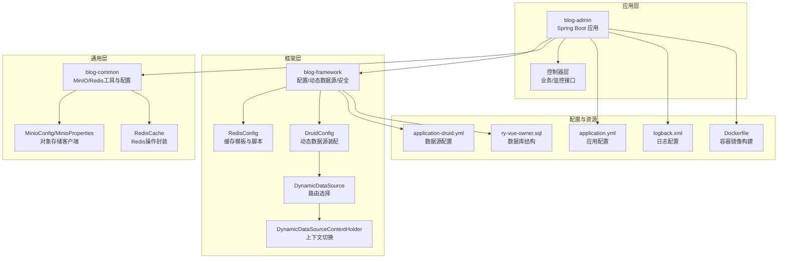
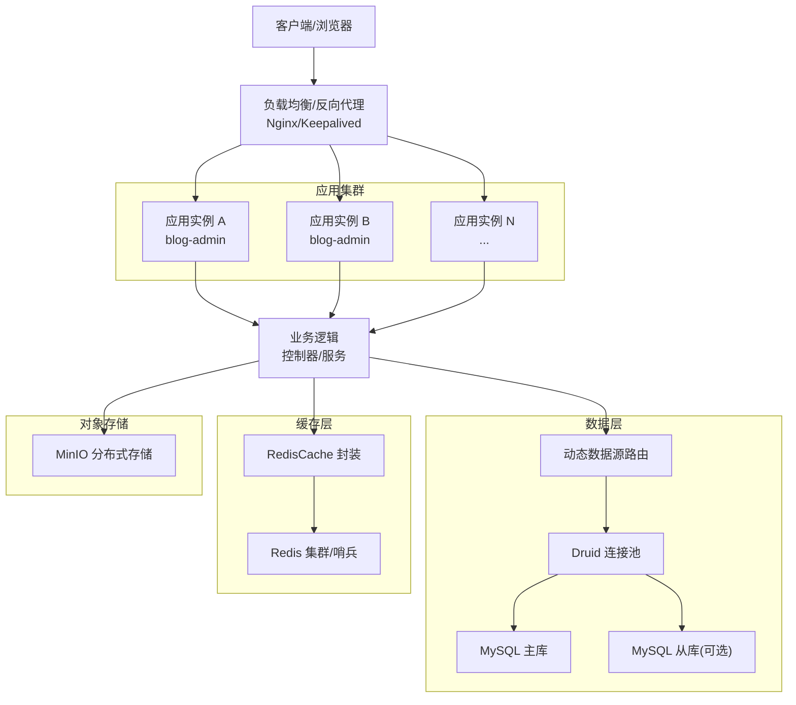
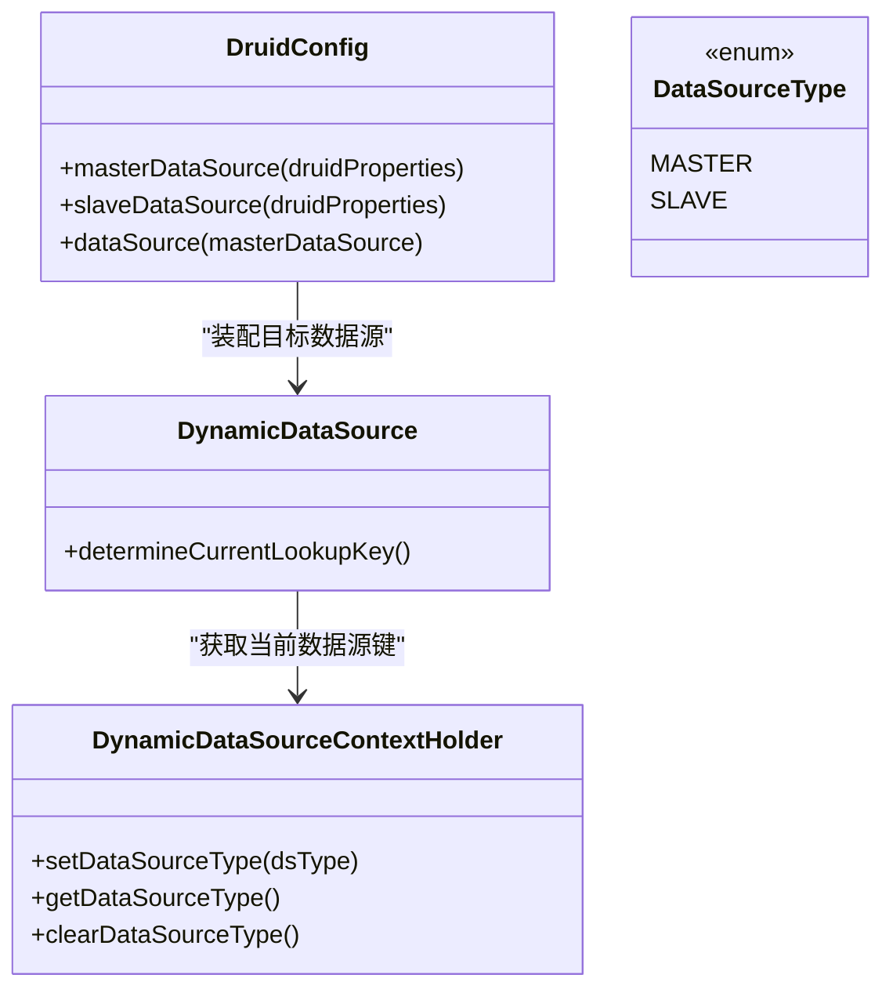
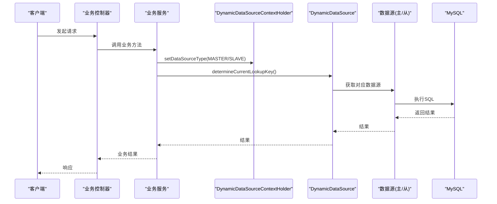
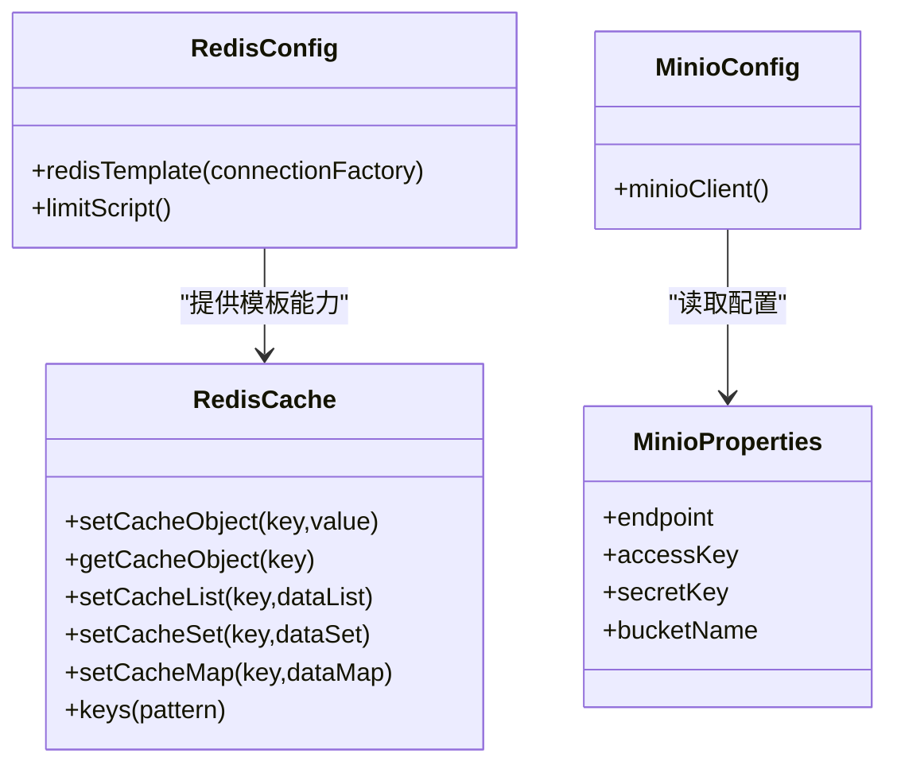
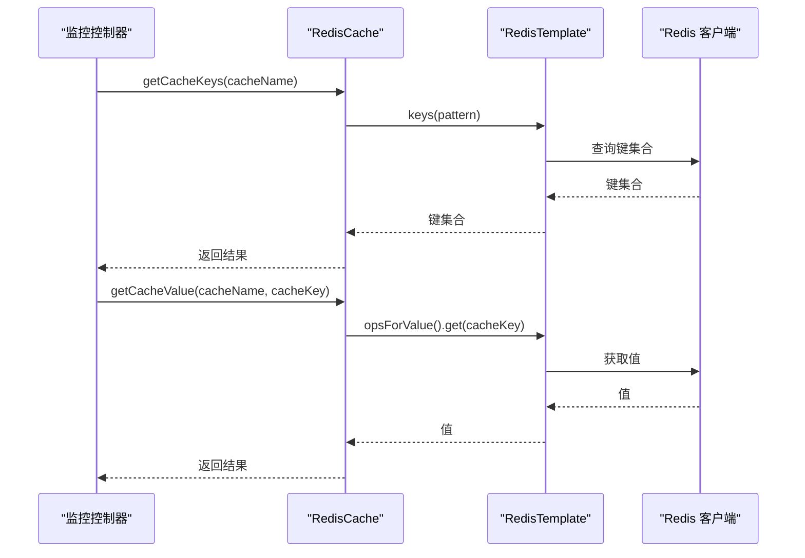
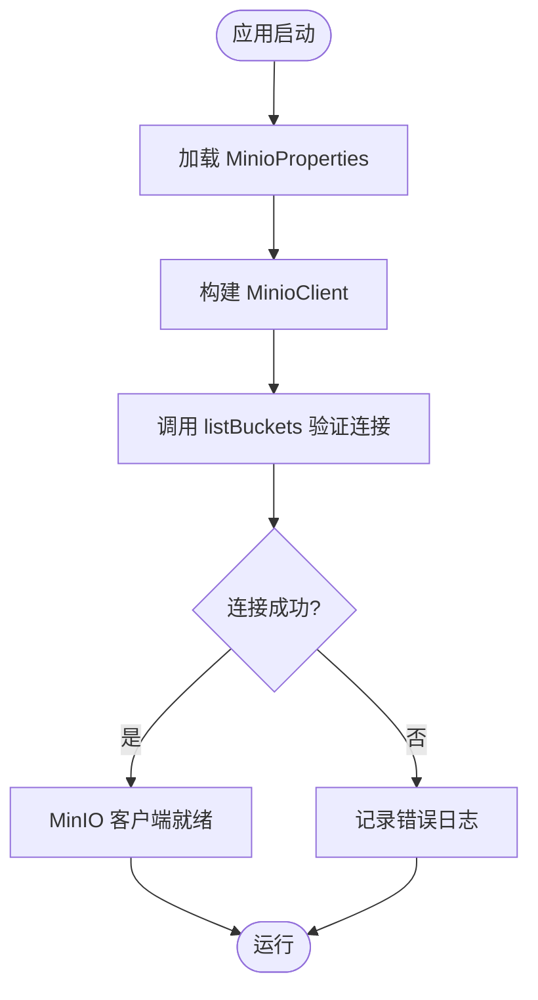
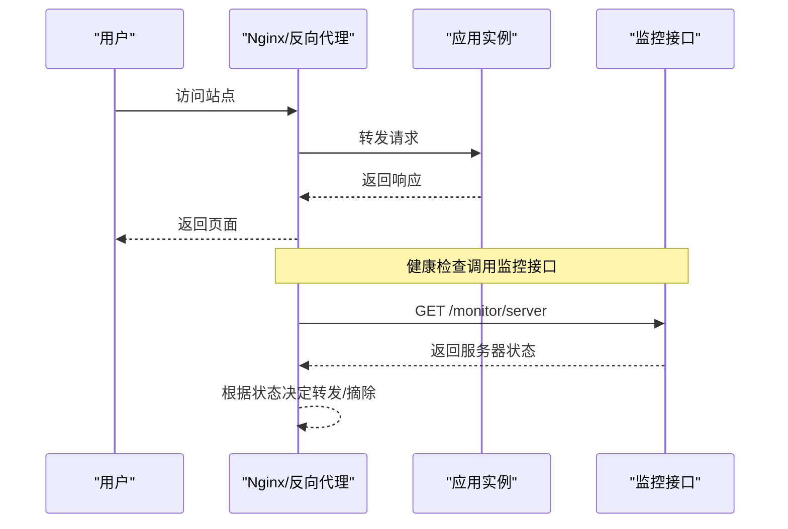
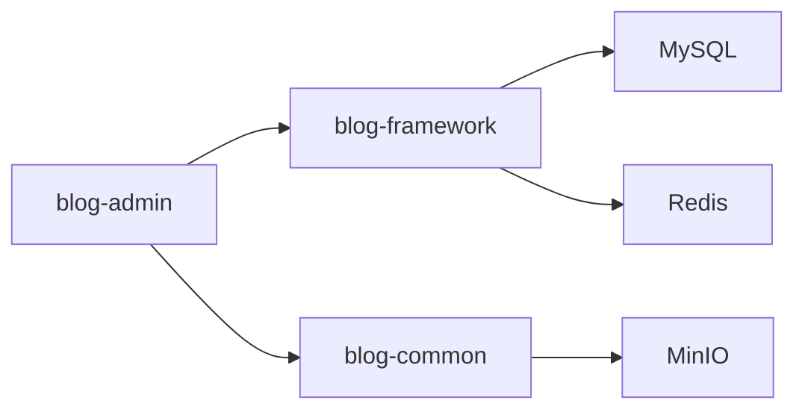

# 高可用部署与故障转移

<cite>
**本文引用的文件**
- [application.yml](file://blog-admin/src/main/resources/application.yml)
- [application-druid.yml](file://blog-admin/src/main/resources/application-druid.yml)
- [Dockerfile](file://blog-admin/Dockerfile)
- [MinioConfig.java](file://blog-common/src/main/java/blog/common/config/minio/MinioConfig.java)
- [MinioProperties.java](file://blog-common/src/main/java/blog/common/config/minio/MinioProperties.java)
- [RedisConfig.java](file://blog-framework/src/main/java/blog/framework/config/RedisConfig.java)
- [RedisCache.java](file://blog-common/src/main/java/blog/common/core/redis/RedisCache.java)
- [DruidConfig.java](file://blog-framework/src/main/java/blog/framework/config/DruidConfig.java)
- [DynamicDataSource.java](file://blog-framework/src/main/java/blog/framework/datasource/DynamicDataSource.java)
- [DynamicDataSourceContextHolder.java](file://blog-framework/src/main/java/blog/framework/datasource/DynamicDataSourceContextHolder.java)
- [ry-vue-owner.sql](file://ry-vue-owner.sql)
- [CacheController.java](file://blog-admin/src/main/java/blog/web/controller/monitor/CacheController.java)
- [ServerController.java](file://blog-admin/src/main/java/blog/web/controller/monitor/ServerController.java)
- [logback.xml](file://blog-admin/src/main/resources/logback.xml)
</cite>

## 目录
1. [简介](#简介)
2. [项目结构](#项目结构)
3. [核心组件](#核心组件)
4. [架构总览](#架构总览)
5. [详细组件分析](#详细组件分析)
6. [依赖关系分析](#依赖关系分析)
7. [性能考量](#性能考量)
8. [故障排查指南](#故障排查指南)
9. [结论](#结论)
10. [附录](#附录)

## 简介
本指南面向高可用部署与故障转移场景，结合代码库现状，系统阐述无状态服务设计、有状态数据分离、负载均衡策略、健康检查机制、数据库高可用、缓存高可用、对象存储高可用、灾难恢复与备份策略等关键主题。文档同时提供架构图示、流程图与最佳实践建议，帮助在生产环境中实现稳定、可扩展、可恢复的系统。

## 项目结构
该项目采用多模块分层组织，核心模块包括：
- blog-admin：Web应用入口，负责对外接口与业务控制器
- blog-framework：框架层，包含配置、拦截器、动态数据源、安全等基础设施
- blog-common：通用工具与配置，如Redis封装、MinIO配置与工具
- blog-biz：业务域模型与服务实现
- blog-system、blog-quartz、blog-generator：系统管理、定时任务、代码生成等子模块

下图为项目模块与关键配置文件的关系示意：

图表来源
- [application.yml:1-161](file://blog-admin/src/main/resources/application.yml#L1-L161)
- [application-druid.yml:1-61](file://blog-admin/src/main/resources/application-druid.yml#L1-L61)
- [Dockerfile:1-15](file://blog-admin/Dockerfile#L1-L15)
- [MinioConfig.java:1-34](file://blog-common/src/main/java/blog/common/config/minio/MinioConfig.java#L1-L34)
- [MinioProperties.java:1-23](file://blog-common/src/main/java/blog/common/config/minio/MinioProperties.java#L1-L23)
- [RedisConfig.java:1-67](file://blog-framework/src/main/java/blog/framework/config/RedisConfig.java#L1-L67)
- [RedisCache.java:1-248](file://blog-common/src/main/java/blog/common/core/redis/RedisCache.java#L1-L248)
- [DruidConfig.java:1-117](file://blog-framework/src/main/java/blog/framework/config/DruidConfig.java#L1-L117)
- [DynamicDataSource.java:1-24](file://blog-framework/src/main/java/blog/framework/datasource/DynamicDataSource.java#L1-L24)
- [DynamicDataSourceContextHolder.java:1-42](file://blog-framework/src/main/java/blog/framework/datasource/DynamicDataSourceContextHolder.java#L1-L42)
- [ry-vue-owner.sql:1-200](file://ry-vue-owner.sql#L1-L200)
- [logback.xml:33-64](file://blog-admin/src/main/resources/logback.xml#L33-L64)

章节来源
- [application.yml:1-161](file://blog-admin/src/main/resources/application.yml#L1-L161)
- [application-druid.yml:1-61](file://blog-admin/src/main/resources/application-druid.yml#L1-L61)
- [Dockerfile:1-15](file://blog-admin/Dockerfile#L1-L15)
- [ry-vue-owner.sql:1-200](file://ry-vue-owner.sql#L1-L200)

## 核心组件
- 无状态服务设计
  - Web应用通过配置文件控制端口、线程池、Tomcat参数，便于横向扩展与容器化部署
  - 通过Dockerfile将应用打包为容器镜像，支持Kubernetes等编排平台的滚动升级与弹性伸缩
- 有状态数据分离
  - 数据库：MySQL通过Druid连接池与动态数据源实现主从配置（从库可启用）
  - 缓存：Redis用于会话、限流、热点数据缓存
  - 对象存储：MinIO作为统一文件存储后端
- 负载均衡与健康检查
  - 可在网关或反向代理层实现健康检查与流量分发
  - 应用内可通过监控接口暴露运行状态，辅助外部健康检查
- 安全与容错
  - XSS防护、防盗链、请求过滤等安全配置
  - 日志分级与归档，便于问题定位与审计

章节来源
- [application.yml:12-29](file://blog-admin/src/main/resources/application.yml#L12-L29)
- [Dockerfile:1-15](file://blog-admin/Dockerfile#L1-L15)
- [application.yml:155-161](file://blog-admin/src/main/resources/application.yml#L155-L161)
- [application.yml:65-89](file://blog-admin/src/main/resources/application.yml#L65-L89)
- [application-druid.yml:1-61](file://blog-admin/src/main/resources/application-druid.yml#L1-L61)
- [logback.xml:33-64](file://blog-admin/src/main/resources/logback.xml#L33-L64)

## 架构总览
下图展示高可用部署视角下的整体架构：应用层无状态、数据层有状态分离、缓存与对象存储独立运维、通过负载均衡与健康检查实现故障转移与弹性扩容。

图表来源
- [application.yml:12-29](file://blog-admin/src/main/resources/application.yml#L12-L29)
- [application.yml:65-89](file://blog-admin/src/main/resources/application.yml#L65-L89)
- [application.yml:155-161](file://blog-admin/src/main/resources/application.yml#L155-L161)
- [application-druid.yml:1-61](file://blog-admin/src/main/resources/application-druid.yml#L1-L61)
- [RedisCache.java:1-248](file://blog-common/src/main/java/blog/common/core/redis/RedisCache.java#L1-L248)
- [DruidConfig.java:1-117](file://blog-framework/src/main/java/blog/framework/config/DruidConfig.java#L1-L117)
- [DynamicDataSource.java:1-24](file://blog-framework/src/main/java/blog/framework/datasource/DynamicDataSource.java#L1-L24)

## 详细组件分析

### 数据库高可用与读写分离
- 主从复制与读写分离
  - 配置文件提供主库与从库占位，从库开关默认关闭，便于按需启用
  - 动态数据源根据上下文选择主/从数据源，实现读写分离
- 连接池与监控
  - Druid连接池提供连接数、超时、检测等参数，支持慢SQL记录与可视化监控界面
- 故障自动切换
  - 当前实现为“从库可选启用”，未见自动故障切换逻辑；建议在生产环境引入数据库高可用方案（如主从复制+自动切换、集群方案）

图表来源
- [DruidConfig.java:33-72](file://blog-framework/src/main/java/blog/framework/config/DruidConfig.java#L33-L72)
- [DynamicDataSource.java:13-24](file://blog-framework/src/main/java/blog/framework/datasource/DynamicDataSource.java#L13-L24)
- [DynamicDataSourceContextHolder.java:11-41](file://blog-framework/src/main/java/blog/framework/datasource/DynamicDataSourceContextHolder.java#L11-L41)

图表来源
- [DynamicDataSource.java:20-23](file://blog-framework/src/main/java/blog/framework/datasource/DynamicDataSource.java#L20-L23)
- [DynamicDataSourceContextHolder.java:23-32](file://blog-framework/src/main/java/blog/framework/datasource/DynamicDataSourceContextHolder.java#L23-L32)
- [DruidConfig.java:50-57](file://blog-framework/src/main/java/blog/framework/config/DruidConfig.java#L50-L57)

章节来源
- [application-druid.yml:1-61](file://blog-admin/src/main/resources/application-druid.yml#L1-L61)
- [DruidConfig.java:33-72](file://blog-framework/src/main/java/blog/framework/config/DruidConfig.java#L33-L72)
- [DynamicDataSource.java:13-24](file://blog-framework/src/main/java/blog/framework/datasource/DynamicDataSource.java#L13-L24)
- [DynamicDataSourceContextHolder.java:11-41](file://blog-framework/src/main/java/blog/framework/datasource/DynamicDataSourceContextHolder.java#L11-L41)

### 缓存高可用配置
- Redis客户端与连接
  - 通过配置文件定义主机、端口、数据库、密码、超时与连接池参数
  - RedisTemplate序列化策略统一，支持多种数据结构操作
- 限流与脚本
  - 提供Lua限流脚本，配合Redis实现分布式限流
- 监控与运维
  - 提供缓存监控接口，支持查看命令统计、缓存键与值

图表来源
- [RedisConfig.java:17-66](file://blog-framework/src/main/java/blog/framework/config/RedisConfig.java#L17-L66)
- [RedisCache.java:24-247](file://blog-common/src/main/java/blog/common/core/redis/RedisCache.java#L24-L247)
- [MinioConfig.java:17-31](file://blog-common/src/main/java/blog/common/config/minio/MinioConfig.java#L17-L31)
- [MinioProperties.java:10-22](file://blog-common/src/main/java/blog/common/config/minio/MinioProperties.java#L10-L22)

图表来源
- [CacheController.java:74-93](file://blog-admin/src/main/java/blog/web/controller/monitor/CacheController.java#L74-L93)
- [RedisCache.java:130-143](file://blog-common/src/main/java/blog/common/core/redis/RedisCache.java#L130-L143)

章节来源
- [application.yml:65-89](file://blog-admin/src/main/resources/application.yml#L65-L89)
- [RedisConfig.java:17-66](file://blog-framework/src/main/java/blog/framework/config/RedisConfig.java#L17-L66)
- [RedisCache.java:24-247](file://blog-common/src/main/java/blog/common/core/redis/RedisCache.java#L24-L247)
- [CacheController.java:60-93](file://blog-admin/src/main/java/blog/web/controller/monitor/CacheController.java#L60-L93)

### 对象存储高可用策略（MinIO）
- MinIO客户端初始化与连通性验证
  - 通过配置类构建MinioClient，并调用API验证连接与认证
- 配置项
  - endpoint、accessKey、secretKey、bucketName由配置文件注入
- 高可用建议
  - 生产环境建议使用MinIO分布式集群，开启纠删码与跨节点数据冗余，结合外部负载均衡与健康检查实现故障转移

图表来源
- [MinioConfig.java:17-31](file://blog-common/src/main/java/blog/common/config/minio/MinioConfig.java#L17-L31)
- [MinioProperties.java:10-22](file://blog-common/src/main/java/blog/common/config/minio/MinioProperties.java#L10-L22)

章节来源
- [application.yml:155-161](file://blog-admin/src/main/resources/application.yml#L155-L161)
- [MinioConfig.java:17-31](file://blog-common/src/main/java/blog/common/config/minio/MinioConfig.java#L17-L31)
- [MinioProperties.java:10-22](file://blog-common/src/main/java/blog/common/config/minio/MinioProperties.java#L10-L22)

### 负载均衡与健康检查
- 应用层
  - 通过配置文件设置HTTP端口、线程池与Tomcat参数，便于横向扩展
  - Dockerfile定义容器镜像与暴露端口，支持容器编排
- 外部负载均衡
  - 建议在Nginx/Keepalived层实现健康检查与会话保持策略
  - 结合服务发现（如Consul/Nacos/Kubernetes Service）实现动态路由
- 健康检查
  - 可利用监控接口返回系统状态，辅助外部健康探针判断实例存活

图表来源
- [application.yml:12-29](file://blog-admin/src/main/resources/application.yml#L12-L29)
- [Dockerfile:10-11](file://blog-admin/Dockerfile#L10-L11)
- [ServerController.java:18-24](file://blog-admin/src/main/java/blog/web/controller/monitor/ServerController.java#L18-L24)

章节来源
- [application.yml:12-29](file://blog-admin/src/main/resources/application.yml#L12-L29)
- [Dockerfile:10-11](file://blog-admin/Dockerfile#L10-L11)
- [ServerController.java:18-24](file://blog-admin/src/main/java/blog/web/controller/monitor/ServerController.java#L18-L24)

### 灾难恢复与备份策略
- 数据库备份与恢复
  - 使用数据库导出脚本进行定期备份，结合增量备份与恢复演练
- 缓存与对象存储
  - 缓存数据可按需重建；对象存储建议开启版本化与跨区域复制
- 日志与审计
  - 启用分级日志与滚动策略，保留足够历史以便问题追踪

章节来源
- [ry-vue-owner.sql:1-200](file://ry-vue-owner.sql#L1-L200)
- [logback.xml:33-64](file://blog-admin/src/main/resources/logback.xml#L33-L64)

## 依赖关系分析
- 组件耦合
  - 应用层依赖框架层提供的动态数据源与Redis配置
  - 通用层提供MinIO与Redis封装，降低上层耦合
- 外部依赖
  - MySQL、Redis、MinIO均为外部有状态组件，需独立高可用部署
- 潜在风险
  - 从库未启用时，读写分离无法生效；建议完善从库配置与自动切换

图表来源
- [application.yml:65-89](file://blog-admin/src/main/resources/application.yml#L65-L89)
- [application.yml:155-161](file://blog-admin/src/main/resources/application.yml#L155-L161)
- [application-druid.yml:1-61](file://blog-admin/src/main/resources/application-druid.yml#L1-L61)

章节来源
- [application.yml:65-89](file://blog-admin/src/main/resources/application.yml#L65-L89)
- [application.yml:155-161](file://blog-admin/src/main/resources/application.yml#L155-L161)
- [application-druid.yml:1-61](file://blog-admin/src/main/resources/application-druid.yml#L1-L61)

## 性能考量
- 连接池与线程池
  - 合理设置Druid连接池参数与Tomcat线程数，避免过载与饥饿
- 缓存命中率
  - 通过RedisCache封装合理设置TTL与键空间，提升热点数据命中率
- I/O与存储
  - MinIO建议使用SSD与纠删码，结合带宽与延迟优化

## 故障排查指南
- 数据库
  - 检查从库开关与连接参数，确认主从连通性
  - 查看Druid监控页面与慢SQL日志
- 缓存
  - 通过监控接口查看键空间与命令统计，定位异常
  - 检查Redis连接与序列化配置
- 对象存储
  - 验证MinIO客户端初始化日志，确认endpoint与凭据正确
- 应用与日志
  - 关注错误日志滚动策略与保留周期，及时定位异常

章节来源
- [application-druid.yml:42-61](file://blog-admin/src/main/resources/application-druid.yml#L42-L61)
- [CacheController.java:60-93](file://blog-admin/src/main/java/blog/web/controller/monitor/CacheController.java#L60-L93)
- [MinioConfig.java:23-29](file://blog-common/src/main/java/blog/common/config/minio/MinioConfig.java#L23-L29)
- [logback.xml:33-64](file://blog-admin/src/main/resources/logback.xml#L33-L64)

## 结论
本项目具备良好的无状态服务设计与清晰的有状态数据分离思路，结合Docker容器化与配置驱动，可快速实现高可用部署。建议在生产环境中补齐数据库自动切换、Redis高可用（集群/哨兵）、MinIO分布式集群与跨节点同步、完善的健康检查与灾备演练，以达成业务连续性与高可用目标。

## 附录
- 快速对照清单
  - 数据库：启用从库配置与主从复制，完善自动切换
  - 缓存：部署Redis高可用，配置持久化与备份
  - 对象存储：MinIO集群+跨节点同步+版本化
  - 负载均衡：Nginx/Keepalived+健康检查+服务发现
  - 监控：应用内监控接口+外部探针+日志分级与归档
  - 备份：数据库定期全量/增量备份+恢复演练