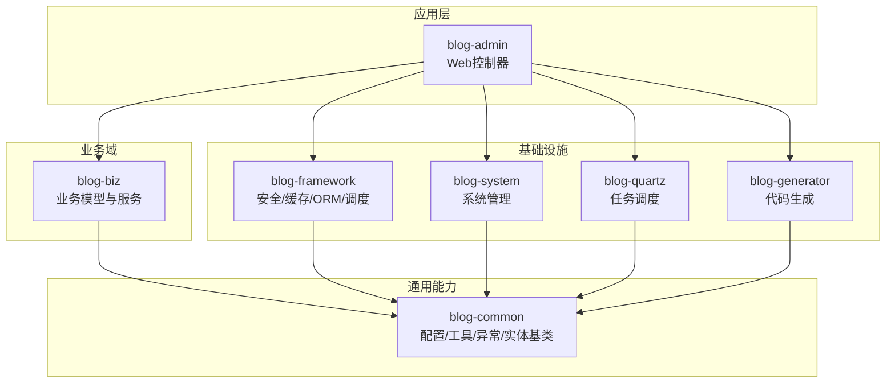
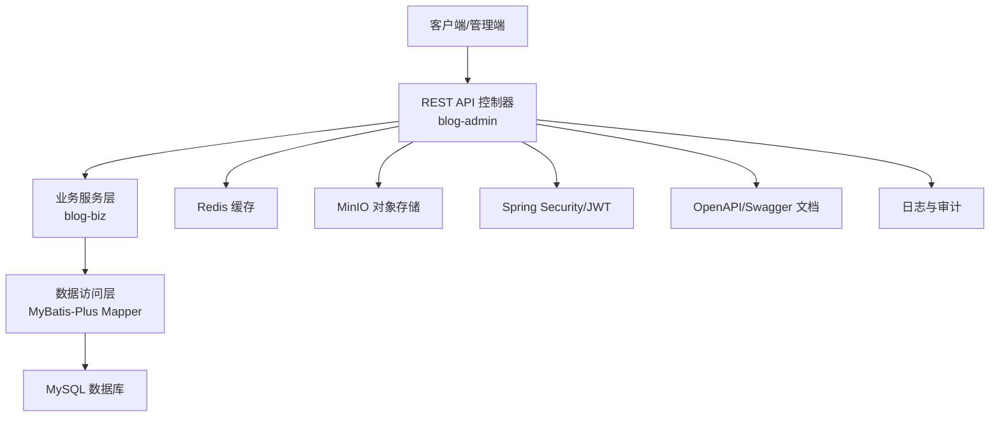
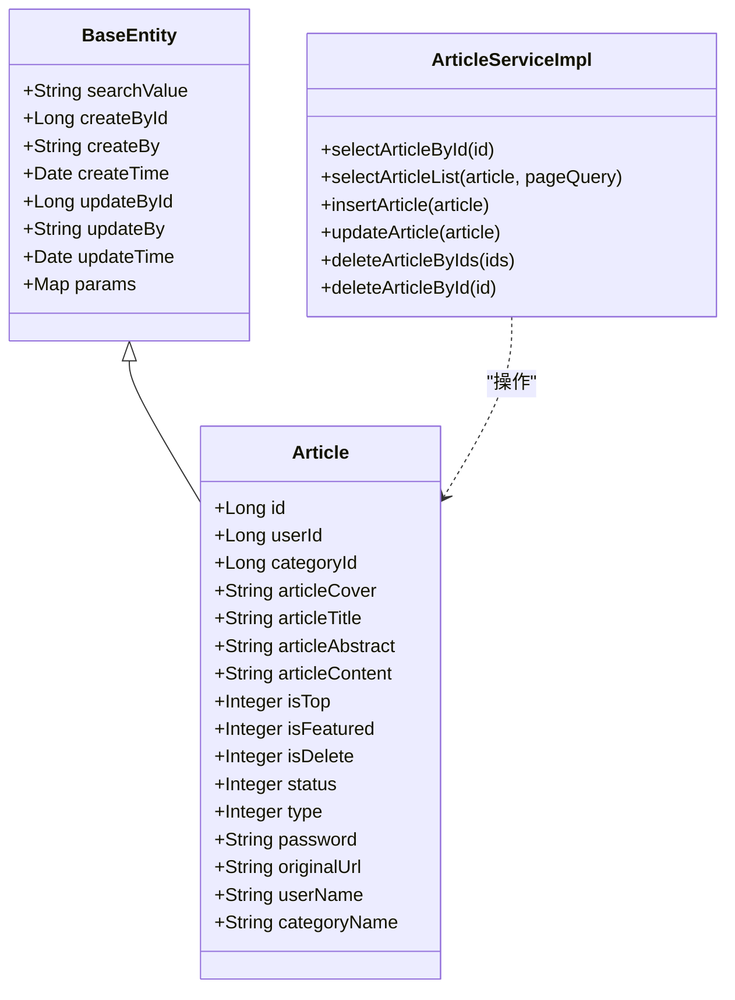
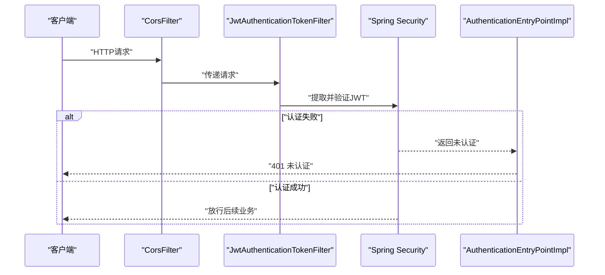
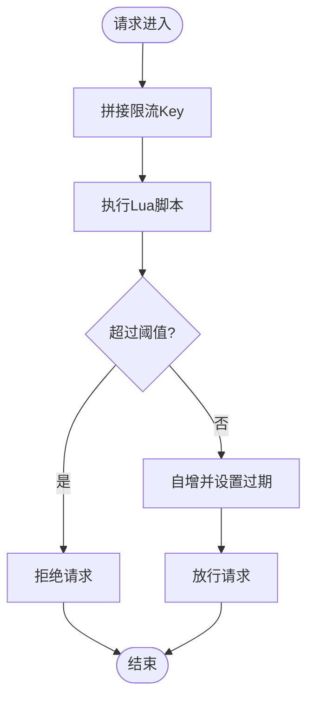
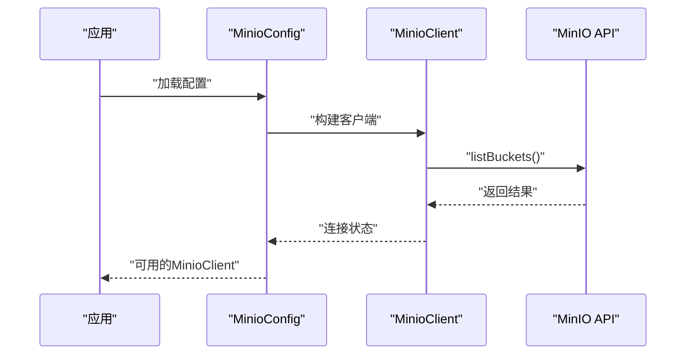
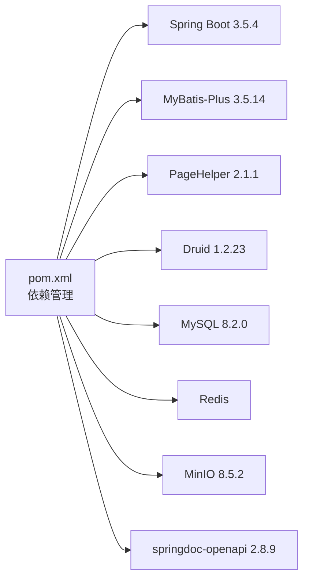

# 项目概述

<cite>
**本文引用的文件**
- [pom.xml](file://pom.xml)
- [BlogServerApplication.java](file://blog-admin/src/main/java/blog/BlogServerApplication.java)
- [application.yml](file://blog-admin/src/main/resources/application.yml)
- [BlogServerConfig.java](file://blog-common/src/main/java/blog/common/config/BlogServerConfig.java)
- [MybatisPlusConfig.java](file://blog-framework/src/main/java/blog/framework/config/MybatisPlusConfig.java)
- [RedisConfig.java](file://blog-framework/src/main/java/blog/framework/config/RedisConfig.java)
- [SecurityConfig.java](file://blog-framework/src/main/java/blog/framework/config/SecurityConfig.java)
- [MinioConfig.java](file://blog-common/src/main/java/blog/common/config/minio/MinioConfig.java)
- [Article.java](file://blog-biz/src/main/java/blog/biz/domain/Article.java)
- [ArticleServiceImpl.java](file://blog-biz/src/main/java/blog/biz/service/impl/ArticleServiceImpl.java)
- [BaseEntity.java](file://blog-common/src/main/java/blog/common/base/entity/BaseEntity.java)
- [Dockerfile](file://blog-admin/Dockerfile)
- [ry-vue-owner.sql](file://ry-vue-owner.sql)
</cite>

## 目录
1. [简介](#简介)
2. [项目结构](#项目结构)
3. [核心组件](#核心组件)
4. [架构总览](#架构总览)
5. [详细组件分析](#详细组件分析)
6. [依赖分析](#依赖分析)
7. [性能考量](#性能考量)
8. [故障排查指南](#故障排查指南)
9. [结论](#结论)
10. [附录](#附录)

## 简介
Leejie博客系统是一个基于Spring Boot的企业级博客管理平台，采用前后端分离架构，提供从内容创作、发布、管理到运维监控的完整能力。项目以模块化设计为核心，围绕“业务域”“基础设施”“通用能力”三层划分，既适合初学者快速理解整体架构，也为有经验的开发者提供了清晰的技术决策背景。

- 核心目标
  - 提供稳定、可扩展、易维护的博客内容管理能力
  - 通过统一的安全、缓存、文件存储与任务调度能力，支撑高并发场景
  - 以模块化与可插拔的方式降低耦合度，提升团队协作效率

- 主要特性
  - 安全认证与授权：基于Spring Security与JWT的无状态认证体系
  - 数据访问：MyBatis-Plus增强与逻辑删除、自动填充、分页拦截器
  - 缓存与限流：Redis缓存与Lua限流脚本
  - 文件存储：MinIO对象存储集成，支持多租户/桶隔离
  - 运维可观测：OpenAPI/Swagger文档、Druid监控、系统健康与性能指标
  - 可靠调度：Quartz任务调度模块

- 技术栈概览
  - 后端框架：Spring Boot 3.5.4、Spring Security、MyBatis-Plus 3.5.14
  - 数据库与连接池：MySQL 8.2.0、Druid 1.2.23
  - 缓存：Redis（含限流脚本）
  - 对象存储：MinIO 8.5.2
  - 文档与工具：springdoc-openapi 2.8.9、PageHelper 2.1.1、Lombok 1.18.36
  - 构建与运行：Maven、Docker

- 差异化优势
  - 统一的“业务域+基础设施+通用能力”三层架构，职责清晰、边界明确
  - 在安全、缓存、文件存储、任务调度等关键领域提供开箱即用的配置与封装
  - 提供完善的模块化与可扩展性设计，便于二次开发与定制

## 项目结构
项目采用多模块聚合工程组织，按“业务域”“基础设施”“通用能力”进行分层：

- blog-admin：应用入口与Web控制器层，负责对外HTTP接口暴露
- blog-biz：业务域模型与服务实现，承载文章、分类、文件等核心业务
- blog-common：通用工具、配置、常量、异常与实体基类
- blog-framework：安全、缓存、MyBatis-Plus、任务调度、拦截器等基础设施
- blog-system：系统管理相关（菜单、角色、用户、字典等），可视为通用后台能力
- blog-quartz：定时任务调度模块
- blog-generator：代码生成模块（可选）

图表来源
- [pom.xml:225-233](file://pom.xml#L225-L233)
- [BlogServerApplication.java:12](file://blog-admin/src/main/java/blog/BlogServerApplication.java#L12)

章节来源
- [pom.xml:225-233](file://pom.xml#L225-L233)
- [BlogServerApplication.java:12](file://blog-admin/src/main/java/blog/BlogServerApplication.java#L12)

## 核心组件
- 应用入口与启动
  - 启动类排除数据源自动装配，结合多模块依赖管理，集中由框架模块提供数据源与事务配置
  - 通过系统属性关闭devtools热部署，确保生产环境稳定性

- 配置中心
  - 项目配置通过BlogServerConfig读取，统一管理文件上传路径、验证码类型、国际化等
  - application.yml集中管理服务器、Redis、MyBatis-Plus、分页、OpenAPI、MinIO等关键配置

- ORM与数据访问
  - MyBatis-Plus配置启用分页、雪花ID生成器（基于网卡）、元对象自动填充
  - 业务实体继承BaseEntity，统一记录创建/更新信息，支持逻辑删除

- 缓存与限流
  - RedisTemplate统一序列化策略，配合Lua限流脚本实现灵活的流量控制

- 安全与认证
  - 基于Spring Security与JWT的无状态认证，支持跨域、匿名放行、登出处理
  - 自定义认证提供器与异常处理，满足企业级安全需求

- 文件存储
  - MinIO配置自动校验连接，支持桶级隔离与对象管理

章节来源
- [BlogServerApplication.java:12-19](file://blog-admin/src/main/java/blog/BlogServerApplication.java#L12-L19)
- [BlogServerConfig.java:13-119](file://blog-common/src/main/java/blog/common/config/BlogServerConfig.java#L13-L119)
- [application.yml:1-161](file://blog-admin/src/main/resources/application.yml#L1-L161)
- [MybatisPlusConfig.java:16-56](file://blog-framework/src/main/java/blog/framework/config/MybatisPlusConfig.java#L16-L56)
- [BaseEntity.java:21-84](file://blog-common/src/main/java/blog/common/base/entity/BaseEntity.java#L21-L84)
- [RedisConfig.java:17-67](file://blog-framework/src/main/java/blog/framework/config/RedisConfig.java#L17-L67)
- [SecurityConfig.java:31-137](file://blog-framework/src/main/java/blog/framework/config/SecurityConfig.java#L31-L137)
- [MinioConfig.java:11-34](file://blog-common/src/main/java/blog/common/config/minio/MinioConfig.java#L11-L34)

## 架构总览
系统采用“控制器-服务-数据访问-存储”的分层架构，结合安全、缓存、文件存储与任务调度等基础设施，形成完整的企业级博客管理能力。

图表来源
- [application.yml:108-161](file://blog-admin/src/main/resources/application.yml#L108-L161)
- [SecurityConfig.java:94-127](file://blog-framework/src/main/java/blog/framework/config/SecurityConfig.java#L94-L127)
- [RedisConfig.java:21-39](file://blog-framework/src/main/java/blog/framework/config/RedisConfig.java#L21-L39)
- [MinioConfig.java:17-31](file://blog-common/src/main/java/blog/common/config/minio/MinioConfig.java#L17-L31)

## 详细组件分析

### 文章域建模与服务
- 数据模型
  - Article实体包含作者、分类、封面、标题、摘要、正文、置顶/推荐、状态、类型、访问密码、原文链接等字段，并继承BaseEntity实现统一审计字段
- 服务实现
  - ArticleServiceImpl基于BaseServiceImpl，提供查询、新增、修改、批量删除等标准CRUD操作，并在新增时注入当前用户信息

图表来源
- [BaseEntity.java:21-84](file://blog-common/src/main/java/blog/common/base/entity/BaseEntity.java#L21-L84)
- [Article.java:24-94](file://blog-biz/src/main/java/blog/biz/domain/Article.java#L24-L94)
- [ArticleServiceImpl.java:21-94](file://blog-biz/src/main/java/blog/biz/service/impl/ArticleServiceImpl.java#L21-L94)

章节来源
- [Article.java:14-94](file://blog-biz/src/main/java/blog/biz/domain/Article.java#L14-L94)
- [ArticleServiceImpl.java:15-94](file://blog-biz/src/main/java/blog/biz/service/impl/ArticleServiceImpl.java#L15-L94)
- [BaseEntity.java:16-84](file://blog-common/src/main/java/blog/common/base/entity/BaseEntity.java#L16-L84)

### 安全与认证流程
- 认证链路
  - 全局禁用CSRF，基于JWT的无状态会话，支持匿名访问白名单、静态资源放行、Swagger文档开放
  - 登录、注册、验证码等接口匿名放行；其余接口需鉴权
  - 支持跨域过滤器与登出处理

图表来源
- [SecurityConfig.java:94-127](file://blog-framework/src/main/java/blog/framework/config/SecurityConfig.java#L94-L127)

章节来源
- [SecurityConfig.java:31-137](file://blog-framework/src/main/java/blog/framework/config/SecurityConfig.java#L31-L137)

### 缓存与限流
- Redis配置
  - 统一Key/Value序列化策略，支持Hash与普通Key两种序列化方式
  - 提供限流脚本Bean，用于基于Redis的滑动窗口或计数器限流

图表来源
- [RedisConfig.java:42-65](file://blog-framework/src/main/java/blog/framework/config/RedisConfig.java#L42-L65)

章节来源
- [RedisConfig.java:17-67](file://blog-framework/src/main/java/blog/framework/config/RedisConfig.java#L17-L67)

### 文件存储与上传
- MinIO配置
  - 通过MinioProperties读取endpoint、accessKey、secretKey、bucketName
  - 启动时调用listBuckets验证连接，日志输出连接状态

图表来源
- [MinioConfig.java:17-31](file://blog-common/src/main/java/blog/common/config/minio/MinioConfig.java#L17-L31)
- [application.yml:155-161](file://blog-admin/src/main/resources/application.yml#L155-L161)

章节来源
- [MinioConfig.java:11-34](file://blog-common/src/main/java/blog/common/config/minio/MinioConfig.java#L11-L34)
- [application.yml:155-161](file://blog-admin/src/main/resources/application.yml#L155-L161)

## 依赖分析
- 版本与依赖管理
  - Spring Boot 3.5.4作为父依赖，统一版本与特性
  - MyBatis-Plus 3.5.14、PageHelper 2.1.1、Druid 1.2.23、MinIO 8.5.2等关键组件版本集中管理
  - 通过模块化pom组织，避免重复依赖与版本冲突

图表来源
- [pom.xml:40-223](file://pom.xml#L40-L223)

章节来源
- [pom.xml:14-38](file://pom.xml#L14-L38)
- [pom.xml:40-223](file://pom.xml#L40-L223)

## 性能考量
- ORM与分页
  - 启用MyBatis-Plus分页插件与溢出保护，避免大页号导致的数据库压力
  - 使用雪花ID生成器并结合网卡信息，避免分布式重复ID
- 缓存与限流
  - Redis统一序列化策略减少序列化开销
  - Lua限流脚本在Redis侧完成原子计数，降低网络往返
- 安全与跨域
  - 无状态认证减少会话存储压力
  - CORS前置过滤器减少不必要的认证开销
- 文件存储
  - MinIO支持高并发对象上传与访问，结合桶隔离与CDN可进一步优化

## 故障排查指南
- 启动与端口
  - 确认server.port与context-path配置正确，避免端口占用
- 数据库连接
  - 检查MySQL驱动版本与连接串，确认Druid监控页面可用
- Redis连接
  - 校验host/port/password/database，确认连接池配置合理
- MinIO连接
  - 校验endpoint/accessKey/secretKey/bucketName，关注MinioConfig日志输出
- 安全与认证
  - 检查JWT密钥与过期时间，确认匿名放行URL配置
- 文档与调试
  - 访问/swagger-ui.html或/v3/api-docs查看接口文档
  - 关注application.yml中的日志级别与国际化资源路径

章节来源
- [application.yml:13-161](file://blog-admin/src/main/resources/application.yml#L13-L161)
- [MinioConfig.java:23-30](file://blog-common/src/main/java/blog/common/config/minio/MinioConfig.java#L23-L30)

## 结论
Leejie博客系统通过模块化与分层设计，将“业务域”“基础设施”“通用能力”有机结合，形成一套可扩展、可维护、可运维的企业级博客管理方案。依托Spring Boot 3.5.4与MyBatis-Plus等核心技术栈，系统在安全、缓存、文件存储与任务调度等方面具备开箱即用的能力，适合中小团队快速落地与持续演进。

## 附录
- 适用场景
  - 中小型企业博客、个人知识库、内容运营平台
  - 需要统一认证、缓存、对象存储与任务调度的业务系统
- 部署方式
  - 本地开发：直接运行BlogServerApplication，或使用Maven打包后启动
  - 容器化：使用Dockerfile构建镜像，部署至Kubernetes或单机容器编排
- 扩展性建议
  - 业务域扩展：新增模块遵循现有分层与命名规范
  - 基础设施扩展：在blog-framework中增加新的配置类与拦截器
  - 存储扩展：根据需要替换MinIO为其他对象存储或CDN
  - 监控扩展：接入Prometheus/Grafana或ELK生态完善可观测性

章节来源
- [Dockerfile:1-15](file://blog-admin/Dockerfile#L1-L15)
- [ry-vue-owner.sql:1-200](file://ry-vue-owner.sql#L1-L200)